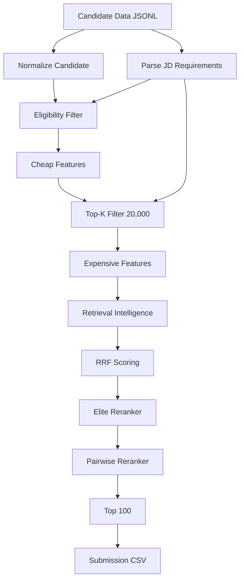

# RedRobe Candidate Ranking System

[](https://github.com/redrobe/candidate-ranking/actions/workflows/ci.yml)
[](https://www.python.org/)
[](https://github.com/psf/black)
[](https://codecov.io/gh/redrobe/candidate-ranking)

## 1. Project Overview

RedRobe is a deterministic, CPU-only candidate ranking pipeline for retrieval engineering roles. It transforms raw candidate profile data into a ranked top-100 submission through 14 feature modules and a 3-stage ranking system (RRF, Elite Reranker, Pairwise Reranker).

**Key properties:**
- Fully deterministic — same inputs always produce identical outputs
- CPU-only — no GPU, LLM, or external API dependencies
- Pipeline SHA256 verified against frozen release
- Production release: v1.1.0-final (Phase 4.6)

## 2. Problem Statement

Given 100,000 candidate profiles and a job description for a retrieval/search engineering role, produce a ranked top-100 list that prioritizes candidates with:
- Deep retrieval system expertise (vector DBs, search algorithms, ranking metrics)
- Production evidence of building and deploying search/ranking systems
- Career trajectory and ownership signals
- Low fraud/embellishment risk

## 3. Dataset

- **Source:** `Data/candidates.jsonl` — 100,000 candidate records
- **Job description:** `Data/job_description.txt`
- **Format:** JSONL with nested profile, career_history, skills, education, certifications
- **Fields:** 30+ per record including anonymized identity, career history, skills, platform signals

## 4. Architecture



Full architecture: `docs/architecture.md`

## 5. Pipeline Stages

| Stage | Module | Description |
|---|---|---|
| Ingestion | `load_candidates.py` | Streams 100K JSONL records in batches |
| JD Parsing | `jd_parser.py` | Extracts must-have, good-to-have requirements |
| Normalization | `candidate_parser.py` | Validates and canonicalizes candidate records |
| Eligibility | `eligibility_features.py` | Filters candidates below 0.25 threshold |
| Cheap Features | 6 modules | Depth, maturity, specialist, risk, alignment, behavioral |
| Prefilter | Phase 4.5 pipeline | Top-20,000 by cheap score composite |
| Expensive Features | 5 modules | Evidence, impact, ownership, quality, JD coverage |
| Intelligence | `retrieval_intelligence.py` | 5-dimension composite (0.3 expertise + 0.2 depth + 0.2 maturity + 0.15 specialist + 0.15 impact) |
| RRF | `rrf_ranker.py` | Reciprocal rank fusion with k=60 |
| Elite Reranker | `elite_reranker.py` | Weighted linear (30% RI, 20% ES, 20% OS, 15% CA, 10% BS, 5% AV) × (1-risk) |
| Pairwise Reranker | `pairwise_elite_v2.py` | Copeland tournament on top-200 |
| Reasoning | `reasoning_generator.py` | Human-readable explanation per candidate |

## 6. Feature Engineering

14 feature modules in `src/features/`:

| Feature | Type | Range | Module |
|---|---|---|---|
| Retrieval Intelligence | Composite | [0,1] | `retrieval_intelligence.py` |
| Retrieval Depth | Cheap | [0,1] | `retrieval_depth_features.py` |
| Retrieval Maturity | Cheap | [0,1] | `retrieval_maturity_features.py` |
| Specialist Probability | Cheap | [0,1] | `retrieval_specialist_classifier.py` |
| Career Alignment | Cheap | [0,1] | `career_alignment_features.py` |
| Risk Score | Cheap | [0,1] | `risk_features.py` |
| Behavior Super Score | Cheap | [0,1] | `behavior_features.py` |
| Evidence Score | Expensive | [0,1] | `evidence_features.py` |
| Retrieval Impact | Expensive | [0,1] | `impact_features.py` |
| Ownership Score | Expensive | [0,1] | `ownership_features.py` |
| Candidate Quality v2 | Expensive | [0,1] | `candidate_quality_v2.py` |
| Eligibility Score | Threshold | [0,1] | `eligibility_features.py` |
| Honeypot Probability | Audit | [0,0.99] | `honeypot_features.py` |
| JD Coverage | Expensive | [0,1] | Pipeline-inline |

Full details: `docs/features.md`

## 7. Ranking System

Three sequential stages:

```
RRF (4 fields, k=60) → Elite Reranker (top-1000) → Pairwise Reranker (top-200) → Top-100
```

**RRF formula:** `rrf_score(i) = Σ 1 / (60 + rank_f(i))` over 4 fields (retrieval_intelligence, evidence_score, career_alignment_score, ownership_score)

**Elite score:** `(0.30*RI + 0.20*ES + 0.20*OS + 0.15*CA + 0.10*BS + 0.05*AV) × (1 - risk_score)`

**Pairwise:** Copeland tournament comparing top-200 candidates on 5 weighted fields (RI 1.5, OS 1.2, ES 1.0, CA 0.8, JDCov 0.5)

Full details: `docs/ranking.md`

## 8. Validation Methodology

6 quality metrics + 12 submission checks:

| Metric | Target | Current |
|---|---|---|
| Score Spread | > 25 | 50.5 |
| Retrieval Specialists | 100% | 100% |
| Zero Retrieval Intelligence | 0 | 0 |
| Honeypot High Risk | 0 | 0 |
| Avg Retrieval Intelligence | ≥ 0.45 | 0.4866 |
| Runtime | < 70s | 0.09s (ranking) |

Full details: `docs/validation.md`

## 9. Results

- **Release:** v1.1.0-final (Phase 4.6)
- **Score spread:** 50.5 (range: 49.5–100.0)
- **Specialist retention:** 100%
- **Pipeline SHA256:** `60CED8C5920EDFBA3A8CCAA65B0CCCC50943C2DE62602D0F26ADF10787D6E4C0`
- **Ranking runtime:** ~0.09s from cache
- **Full pipeline runtime:** ~82s (Phase 4.5)

## 10. Repository Structure

```
├── Data/                     Candidate data + job description
├── archive/                  Research artifacts (not production)
├── configs/                  Weights, skill taxonomy YAML
├── docs/                     Architecture, features, ranking, validation
├── outputs/                  Generated submissions, reports, caches
├── release_v110/             Frozen v1.1.0-final artifacts
├── scripts/                  Pipeline scripts
├── src/                      Source code
│   ├── features/             14 feature modules
│   ├── ingestion/            Data loading
│   ├── parser/               JD + candidate parsing
│   ├── ranking/              3 ranking modules
│   └── utils/                Logging
├── tests/                    Unit + integration tests
├── .github/workflows/        CI/CD
├── pyproject.toml            Project configuration
├── .pre-commit-config.yaml   Pre-commit hooks
├── requirements.txt          Dependencies
└── VERSION                   Release version
```

## 11. Installation

```bash
# Clone repository
git clone https://github.com/redrobe/candidate-ranking.git
cd candidate-ranking

# Install production dependencies
pip install -r requirements.txt

# Install dev dependencies (for testing)
pip install -r requirements-dev.txt
```

Requires Python 3.10+.

## 12. Usage

### Rank candidates (Phase 4.6, from cache)

```bash
python scripts/phase46_optimization.py
```

### Full pipeline (Phase 4.5 + 4.6)

```bash
# Stage 1: Feature computation and caching
python scripts/phase45_pipeline.py \
  --candidates Data/candidates.jsonl \
  --jd Data/job_description.txt \
  --submission outputs/phase45_submission.csv \
  --stage2_k 20000

# Stage 2: Optimized ranking
python scripts/phase46_optimization.py

# Stage 3: Release freeze
python scripts/phase46_release_freeze.py
```

### Streamlit dashboard (optional)

```bash
streamlit run app.py
```

## 13. Running the Pipeline

```bash
# Complete end-to-end
python scripts/phase45_pipeline.py --candidates Data/candidates.jsonl --jd Data/job_description.txt
python scripts/phase46_optimization.py
python scripts/phase46_release_freeze.py
```

Outputs are written to `outputs/`. Release artifacts go to `release_v110/`.

## 14. Testing

```bash
# Run all tests
pytest tests/ -v

# Run with coverage
pytest tests/ --cov=src --cov-report=term-missing

# Run integration tests only
pytest tests/integration/ -v
```

Coverage target: ≥ 80% on `src/` modules.

Full guide: `docs/testing.md`

## 15. Release Process

1. Run Phase 4.5 pipeline → generates cache + Phase 4.5 submission
2. Run Phase 4.6 optimization → loads cache, applies ranking → Phase 4.6 submission
3. Run Phase 4.6 release freeze → validates 12 checks → freezes to `release_v110/`
4. Verify SHA256 match between `outputs/` and `release_v110/`

Full details: `docs/release_process.md`

## 16. Future Work

- Authenticity enhancement (Phase 47 research archived for reference)
- SVM-based specialist detection refinement
- Additional ranking metrics investigation
- CI pipeline for automated regression testing
- Coverage threshold enforcement in CI